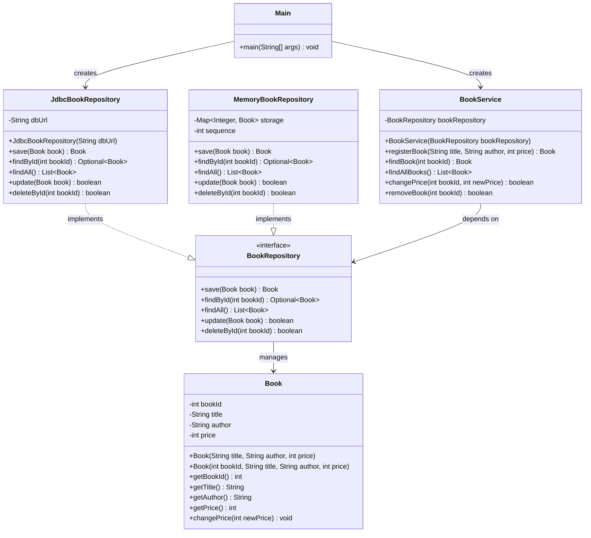
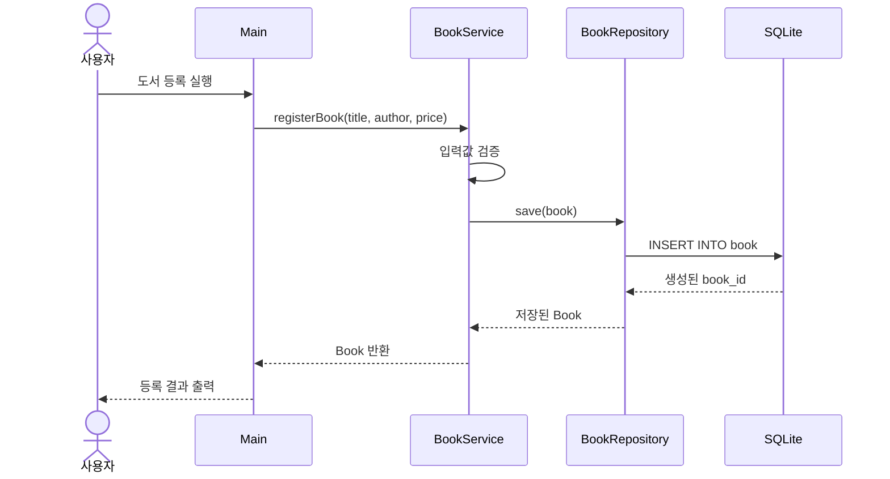
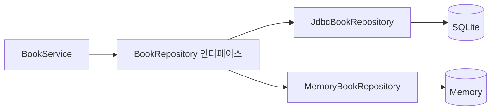

# Java Repository 패턴

Repository 패턴은 **비즈니스 로직과 데이터 저장 로직을 분리**하는 설계 패턴입니다.

예를 들어 `BookService`가 SQLite에 직접 SQL을 실행하지 않고 다음과 같이 Repository에 요청합니다.

```java
Book book = bookRepository.findById(1);
```

`BookService`는 데이터가 SQLite에 저장되는지, 파일에 저장되는지 알 필요가 없습니다.

---

## 1. Repository 패턴을 사용하지 않은 코드

```java
public class BookService {

    public void registerBook(String title, String author, int price) {
        String sql = """
                INSERT INTO book(title, author, price)
                VALUES (?, ?, ?)
                """;

        try (
            Connection connection =
                DriverManager.getConnection("jdbc:sqlite:data/library.db");
            PreparedStatement statement =
                connection.prepareStatement(sql)
        ) {
            statement.setString(1, title);
            statement.setString(2, author);
            statement.setInt(3, price);

            statement.executeUpdate();

        } catch (SQLException e) {
            e.printStackTrace();
        }
    }
}
```

이 코드에는 다음 역할이 모두 섞여 있습니다.

- 도서 등록이라는 업무 처리
- 데이터베이스 연결
- SQL 작성
- SQL 매개변수 설정
- 데이터베이스 예외 처리

서비스 클래스가 데이터베이스 구현에 강하게 의존하게 됩니다.

---

## 2. Repository 패턴 구조

Repository 패턴을 적용하면 일반적으로 다음과 같이 역할을 나눕니다.

| 구성 요소 | 역할 |
|---|---|
| `Book` | 도서 데이터를 표현하는 도메인 객체 |
| `BookRepository` | 저장소가 제공해야 할 기능을 선언하는 인터페이스 |
| `JdbcBookRepository` | JDBC와 SQLite를 사용하는 실제 구현체 |
| `BookService` | 도서 등록, 가격 변경 등 비즈니스 로직 |
| `Main` | 객체 생성과 프로그램 실행 |

---

## 3. UML 클래스 다이어그램

> GitHub에서는 아래 Mermaid 코드가 UML 그림으로 표시됩니다.



핵심 관계는 다음과 같습니다.

```text
BookService ──의존──> BookRepository <──구현── JdbcBookRepository
                                      <──구현── MemoryBookRepository
```

`BookService`가 구체 클래스인 `JdbcBookRepository`가 아니라 인터페이스인 `BookRepository`에 의존한다는 것이 중요합니다.

---

## 4. 프로젝트 구조

```text
repository-example/
├── pom.xml
├── data/
│   └── library.db
└── src/
    └── main/
        └── java/
            └── com/
                └── example/
                    ├── Main.java
                    ├── domain/
                    │   └── Book.java
                    ├── repository/
                    │   ├── BookRepository.java
                    │   ├── JdbcBookRepository.java
                    │   ├── MemoryBookRepository.java
                    │   └── RepositoryException.java
                    └── service/
                        └── BookService.java
```

---

## 5. 데이터베이스 테이블

```sql
CREATE TABLE IF NOT EXISTS book (
    book_id INTEGER PRIMARY KEY AUTOINCREMENT,
    title TEXT NOT NULL,
    author TEXT NOT NULL,
    price INTEGER NOT NULL CHECK (price >= 0)
);
```

---

## 6. 도메인 클래스

### `Book.java`

```java
package com.example.domain;

public class Book {

    private int bookId;
    private String title;
    private String author;
    private int price;

    // INSERT 전 객체 생성용
    public Book(String title, String author, int price) {
        this(0, title, author, price);
    }

    // 조회 결과 객체 생성용
    public Book(int bookId, String title, String author, int price) {
        this.bookId = bookId;
        this.title = title;
        this.author = author;
        this.price = price;
    }

    public int getBookId() {
        return bookId;
    }

    public String getTitle() {
        return title;
    }

    public String getAuthor() {
        return author;
    }

    public int getPrice() {
        return price;
    }

    public void changePrice(int newPrice) {
        if (newPrice < 0) {
            throw new IllegalArgumentException(
                "가격은 0원 이상이어야 합니다."
            );
        }

        this.price = newPrice;
    }

    @Override
    public String toString() {
        return "Book{" +
                "bookId=" + bookId +
                ", title='" + title + '\'' +
                ", author='" + author + '\'' +
                ", price=" + price +
                '}';
    }
}
```

`Book`은 SQL을 알지 못합니다.

즉, `Book` 안에는 다음 코드가 들어가지 않습니다.

```java
DriverManager.getConnection(...);
PreparedStatement statement = ...;
```

`Book`은 도서 데이터와 도서가 수행할 수 있는 행위만 표현합니다.

---

## 7. Repository 인터페이스

### `BookRepository.java`

```java
package com.example.repository;

import com.example.domain.Book;

import java.util.List;
import java.util.Optional;

public interface BookRepository {

    Book save(Book book);

    Optional<Book> findById(int bookId);

    List<Book> findAll();

    boolean update(Book book);

    boolean deleteById(int bookId);
}
```

인터페이스에는 SQL이 없습니다.

Repository가 제공해야 할 기능만 선언합니다.

```java
Book save(Book book);
```

이는 다음 의미입니다.

> `Book` 객체를 저장하고 저장된 `Book` 객체를 반환한다.

저장 방법이 SQLite인지 PostgreSQL인지 메모리인지는 인터페이스에서 결정하지 않습니다.

---

## 8. JDBC Repository 구현체

### `JdbcBookRepository.java`

```java
package com.example.repository;

import com.example.domain.Book;

import java.sql.*;
import java.util.ArrayList;
import java.util.List;
import java.util.Optional;

public class JdbcBookRepository implements BookRepository {

    private final String dbUrl;

    public JdbcBookRepository(String dbUrl) {
        this.dbUrl = dbUrl;
    }

    private Connection getConnection() throws SQLException {
        return DriverManager.getConnection(dbUrl);
    }

    @Override
    public Book save(Book book) {
        String sql = """
                INSERT INTO book(title, author, price)
                VALUES (?, ?, ?)
                """;

        try (
            Connection connection = getConnection();
            PreparedStatement statement = connection.prepareStatement(
                sql,
                Statement.RETURN_GENERATED_KEYS
            )
        ) {
            statement.setString(1, book.getTitle());
            statement.setString(2, book.getAuthor());
            statement.setInt(3, book.getPrice());

            int affectedRows = statement.executeUpdate();

            if (affectedRows == 0) {
                throw new RepositoryException("도서 등록에 실패했습니다.");
            }

            try (ResultSet generatedKeys = statement.getGeneratedKeys()) {
                if (generatedKeys.next()) {
                    int bookId = generatedKeys.getInt(1);

                    return new Book(
                        bookId,
                        book.getTitle(),
                        book.getAuthor(),
                        book.getPrice()
                    );
                }
            }

            throw new RepositoryException(
                "생성된 도서 번호를 가져오지 못했습니다."
            );

        } catch (SQLException e) {
            throw new RepositoryException(
                "도서 등록 중 오류가 발생했습니다.",
                e
            );
        }
    }

    @Override
    public Optional<Book> findById(int bookId) {
        String sql = """
                SELECT book_id, title, author, price
                FROM book
                WHERE book_id = ?
                """;

        try (
            Connection connection = getConnection();
            PreparedStatement statement = connection.prepareStatement(sql)
        ) {
            statement.setInt(1, bookId);

            try (ResultSet resultSet = statement.executeQuery()) {
                if (resultSet.next()) {
                    return Optional.of(mapToBook(resultSet));
                }
            }

            return Optional.empty();

        } catch (SQLException e) {
            throw new RepositoryException(
                "도서 조회 중 오류가 발생했습니다.",
                e
            );
        }
    }

    @Override
    public List<Book> findAll() {
        String sql = """
                SELECT book_id, title, author, price
                FROM book
                ORDER BY book_id
                """;

        List<Book> books = new ArrayList<>();

        try (
            Connection connection = getConnection();
            PreparedStatement statement = connection.prepareStatement(sql);
            ResultSet resultSet = statement.executeQuery()
        ) {
            while (resultSet.next()) {
                books.add(mapToBook(resultSet));
            }

            return books;

        } catch (SQLException e) {
            throw new RepositoryException(
                "전체 도서 조회 중 오류가 발생했습니다.",
                e
            );
        }
    }

    @Override
    public boolean update(Book book) {
        String sql = """
                UPDATE book
                SET title = ?,
                    author = ?,
                    price = ?
                WHERE book_id = ?
                """;

        try (
            Connection connection = getConnection();
            PreparedStatement statement = connection.prepareStatement(sql)
        ) {
            statement.setString(1, book.getTitle());
            statement.setString(2, book.getAuthor());
            statement.setInt(3, book.getPrice());
            statement.setInt(4, book.getBookId());

            return statement.executeUpdate() > 0;

        } catch (SQLException e) {
            throw new RepositoryException(
                "도서 수정 중 오류가 발생했습니다.",
                e
            );
        }
    }

    @Override
    public boolean deleteById(int bookId) {
        String sql = """
                DELETE FROM book
                WHERE book_id = ?
                """;

        try (
            Connection connection = getConnection();
            PreparedStatement statement = connection.prepareStatement(sql)
        ) {
            statement.setInt(1, bookId);

            return statement.executeUpdate() > 0;

        } catch (SQLException e) {
            throw new RepositoryException(
                "도서 삭제 중 오류가 발생했습니다.",
                e
            );
        }
    }

    private Book mapToBook(ResultSet resultSet) throws SQLException {
        return new Book(
            resultSet.getInt("book_id"),
            resultSet.getString("title"),
            resultSet.getString("author"),
            resultSet.getInt("price")
        );
    }
}
```

---

## 9. Repository 예외 클래스

### `RepositoryException.java`

```java
package com.example.repository;

public class RepositoryException extends RuntimeException {

    public RepositoryException(String message) {
        super(message);
    }

    public RepositoryException(String message, Throwable cause) {
        super(message, cause);
    }
}
```

Repository에서 발생한 `SQLException`을 그대로 서비스 계층에 전달하지 않고 Repository 계층의 예외로 변환합니다.

```text
SQLException
    ↓ 변환
RepositoryException
```

이렇게 하면 `BookService`가 JDBC 예외를 직접 알 필요가 없습니다.

---

## 10. Service 클래스

### `BookService.java`

```java
package com.example.service;

import com.example.domain.Book;
import com.example.repository.BookRepository;

import java.util.List;

public class BookService {

    private final BookRepository bookRepository;

    public BookService(BookRepository bookRepository) {
        this.bookRepository = bookRepository;
    }

    public Book registerBook(
            String title,
            String author,
            int price
    ) {
        validateTitle(title);
        validateAuthor(author);
        validatePrice(price);

        Book book = new Book(title, author, price);

        return bookRepository.save(book);
    }

    public Book findBook(int bookId) {
        return bookRepository.findById(bookId)
                .orElseThrow(
                    () -> new IllegalArgumentException(
                        "도서를 찾을 수 없습니다. bookId=" + bookId
                    )
                );
    }

    public List<Book> findAllBooks() {
        return bookRepository.findAll();
    }

    public boolean changePrice(int bookId, int newPrice) {
        validatePrice(newPrice);

        Book book = findBook(bookId);
        book.changePrice(newPrice);

        return bookRepository.update(book);
    }

    public boolean removeBook(int bookId) {
        findBook(bookId);

        return bookRepository.deleteById(bookId);
    }

    private void validateTitle(String title) {
        if (title == null || title.isBlank()) {
            throw new IllegalArgumentException(
                "도서 제목을 입력해야 합니다."
            );
        }
    }

    private void validateAuthor(String author) {
        if (author == null || author.isBlank()) {
            throw new IllegalArgumentException(
                "저자를 입력해야 합니다."
            );
        }
    }

    private void validatePrice(int price) {
        if (price < 0) {
            throw new IllegalArgumentException(
                "가격은 0원 이상이어야 합니다."
            );
        }
    }
}
```

Service에는 SQL이 없습니다.

```java
bookRepository.save(book);
bookRepository.findById(bookId);
bookRepository.update(book);
```

Service는 **무엇을 할 것인지**를 담당하고 Repository는 **어떻게 저장할 것인지**를 담당합니다.

---

## 11. Main 클래스

### `Main.java`

```java
package com.example;

import com.example.domain.Book;
import com.example.repository.BookRepository;
import com.example.repository.JdbcBookRepository;
import com.example.service.BookService;

import java.util.List;

public class Main {

    public static void main(String[] args) {
        String dbUrl = "jdbc:sqlite:data/library.db";

        BookRepository bookRepository =
                new JdbcBookRepository(dbUrl);

        BookService bookService =
                new BookService(bookRepository);

        Book savedBook = bookService.registerBook(
            "자바의 정석",
            "남궁성",
            30_000
        );

        System.out.println("등록 결과");
        System.out.println(savedBook);

        System.out.println("\n전체 도서");
        List<Book> books = bookService.findAllBooks();

        for (Book book : books) {
            System.out.println(book);
        }

        System.out.println("\n가격 변경");
        boolean updated = bookService.changePrice(
            savedBook.getBookId(),
            27_000
        );

        System.out.println("수정 결과: " + updated);

        Book updatedBook =
                bookService.findBook(savedBook.getBookId());

        System.out.println(updatedBook);
    }
}
```

객체 생성 과정은 다음과 같습니다.

```java
BookRepository bookRepository =
        new JdbcBookRepository(dbUrl);

BookService bookService =
        new BookService(bookRepository);
```

`BookService` 외부에서 Repository 객체를 전달하는 방식을 **의존성 주입(Dependency Injection)**이라고 합니다.

---

## 12. 실행 흐름

도서를 등록할 때 호출 흐름은 다음과 같습니다.



---

## 13. Repository를 메모리 구현체로 교체하기

Repository 인터페이스를 사용하는 가장 큰 이유 중 하나는 구현체를 교체할 수 있다는 것입니다.

### `MemoryBookRepository.java`

```java
package com.example.repository;

import com.example.domain.Book;

import java.util.ArrayList;
import java.util.LinkedHashMap;
import java.util.List;
import java.util.Map;
import java.util.Optional;

public class MemoryBookRepository implements BookRepository {

    private final Map<Integer, Book> storage =
            new LinkedHashMap<>();

    private int sequence = 0;

    @Override
    public Book save(Book book) {
        int bookId = ++sequence;

        Book savedBook = new Book(
            bookId,
            book.getTitle(),
            book.getAuthor(),
            book.getPrice()
        );

        storage.put(bookId, savedBook);

        return savedBook;
    }

    @Override
    public Optional<Book> findById(int bookId) {
        return Optional.ofNullable(storage.get(bookId));
    }

    @Override
    public List<Book> findAll() {
        return new ArrayList<>(storage.values());
    }

    @Override
    public boolean update(Book book) {
        if (!storage.containsKey(book.getBookId())) {
            return false;
        }

        storage.put(book.getBookId(), book);
        return true;
    }

    @Override
    public boolean deleteById(int bookId) {
        return storage.remove(bookId) != null;
    }
}
```

이제 `Main`에서 한 줄만 바꾸면 됩니다.

### SQLite 사용

```java
BookRepository bookRepository =
        new JdbcBookRepository("jdbc:sqlite:data/library.db");
```

### 메모리 사용

```java
BookRepository bookRepository =
        new MemoryBookRepository();
```

`BookService` 코드는 변경되지 않습니다.

```java
BookService bookService =
        new BookService(bookRepository);
```

이것이 Repository 패턴과 인터페이스를 사용하는 핵심 효과입니다.

---

## 14. Repository 패턴의 핵심 원리

### 인터페이스가 없는 경우

```text
BookService
    ↓
JdbcBookRepository
    ↓
SQLite
```

서비스가 JDBC 구현체에 직접 의존합니다.

### 인터페이스가 있는 경우



서비스는 저장 방식이 아니라 Repository의 기능에만 의존합니다.

---

## 15. Repository와 DAO의 차이

Repository와 DAO는 비슷하지만 관점에 차이가 있습니다.

| 구분 | DAO | Repository |
|---|---|---|
| 중심 관점 | 테이블과 SQL | 도메인 객체 |
| 메서드 예 | `insertBook()` | `save(book)` |
| 반환 형태 | 행, DTO, 값 | 도메인 객체 |
| 주 사용 위치 | 데이터 접근 계층 | 도메인과 데이터 접근 계층 사이 |
| 추상화 수준 | 비교적 낮음 | 비교적 높음 |

교육 초반에는 다음처럼 설명해도 충분합니다.

> DAO는 SQL과 테이블 중심이고 Repository는 객체와 도메인 중심이다.

다만 실무에서는 두 용어가 엄격하게 구분되지 않고 혼용되기도 합니다.

---

## 16. 수업에서 강조할 코드

Repository 패턴 수업의 핵심은 CRUD 코드를 모두 외우는 것이 아니라 다음 관계를 이해하는 것입니다.

```java
public interface BookRepository {
    Book save(Book book);
}
```

```java
public class JdbcBookRepository
        implements BookRepository {

    @Override
    public Book save(Book book) {
        // JDBC 코드
    }
}
```

```java
public class BookService {

    private final BookRepository bookRepository;

    public BookService(BookRepository bookRepository) {
        this.bookRepository = bookRepository;
    }
}
```

학생들에게는 다음 세 문장으로 정리할 수 있습니다.

1. **Repository 인터페이스는 저장소가 해야 할 일을 정의한다.**
2. **구현 클래스는 그 일을 실제로 수행한다.**
3. **Service는 구현 클래스가 아니라 인터페이스에 의존한다.**

---

## 17. 수업 진행 권장 순서

첫 단계에서는 클래스 수를 줄여 다음 네 개만 보여주는 편이 좋습니다.

```text
Book
BookRepository
JdbcBookRepository
Main
```

학생들이 구조를 이해한 후 `BookService`를 추가합니다.

```text
1단계: Main → Repository → SQLite
2단계: Main → Service → Repository → SQLite
3단계: JDBC Repository와 Memory Repository 교체
```

Repository 패턴을 처음부터 예외 클래스, DTO, Mapper, Factory까지 포함해 설명하면 학생들은 패턴보다 파일 구조에 더 큰 부담을 느낄 수 있습니다.

첫 수업에서는 다음 사실을 체감시키는 것이 핵심입니다.

> 인터페이스를 사이에 두면 저장 방식이 바뀌어도 Service 코드를 변경하지 않을 수 있다.

---

## 18. 최종 정리

Repository 패턴의 전체 구조는 다음과 같습니다.

```text
사용자
  ↓
Main 또는 Controller
  ↓
BookService
  ↓
BookRepository 인터페이스
  ↓
JdbcBookRepository
  ↓
SQLite
```

Repository 패턴을 적용하면 얻을 수 있는 장점은 다음과 같습니다.

- 비즈니스 로직과 SQL 코드가 분리됩니다.
- 데이터 저장 방식을 교체하기 쉬워집니다.
- Service 단위 테스트가 쉬워집니다.
- 각 클래스의 책임이 명확해집니다.
- JDBC 코드가 특정 계층에 모이므로 유지보수가 쉬워집니다.

핵심 코드는 다음 한 줄입니다.

```java
private final BookRepository bookRepository;
```

이 코드는 `BookService`가 JDBC나 SQLite가 아니라 **저장소의 추상적인 기능**에 의존한다는 의미입니다.
